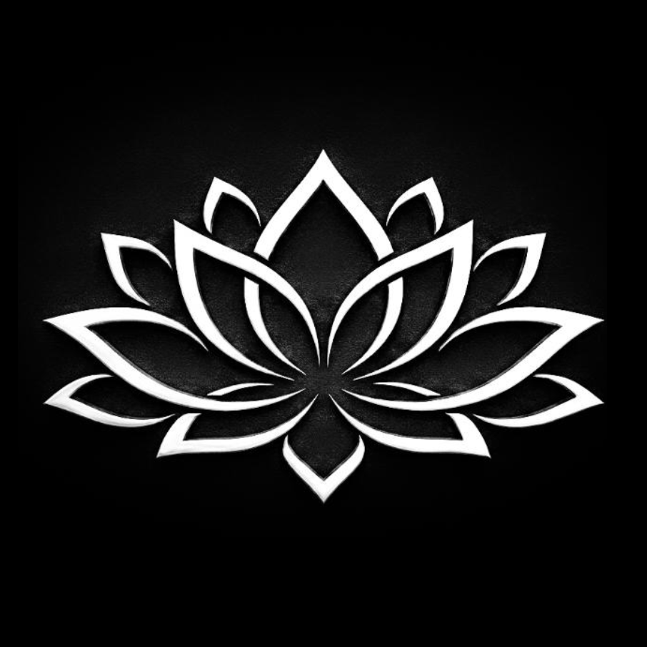

<div align="center">
  
  <h1>Neuro Track</h1>
  <p><strong>Student Health & Wellness Telemetry System</strong></p>
  <p><em>Early Awareness. Stronger Tomorrows.</em></p>
</div>

---

**Neuro Track** is a smart digital health platform designed for secondary school and college students. It helps track emotional well-being and stress levels by combining **simple self-assessment questionnaires** with **real-time wearable health telemetry** (Heart Rate, Blood Oxygen SpO₂, Body Temperature, and Sleep Monitoring).

> **Note:** The platform works **100% out of the box with or without hardware**. If no wearable band is connected, the website safely displays `"Not Applicable"` with a flatline baseline — no errors or crashes.

---

## 🚀 Quick Start Guide (Run from Scratch)

Follow these simple steps after downloading and extracting the project ZIP.

### Step 1: Prerequisites
Make sure you have **Node.js** installed on your computer.
- Download from [nodejs.org](https://nodejs.org/) (LTS version recommended).
- To check if it's installed, open Command Prompt or PowerShell and type:
  ```bash
  node -v
  npm -v
  ```

---

### Step 2: Open the Backend Folder
1. Extract the downloaded ZIP file to any folder on your computer.
2. Open your terminal (Command Prompt, PowerShell, or VS Code terminal).
3. Navigate into the `Backend` directory:
   ```bash
   cd "Backend"
   ```
   *(Or right-click inside the `Backend` folder and select **Open in Terminal**)*

---

### Step 3: Install Dependencies
Install the required packages by running:
```bash
npm install
```
*(This only needs to be run once. It takes about 10–20 seconds).*

---

### Step 4: Start the Server
Start the backend server:
```bash
npm run dev
```

You will see:
```text
Server running on http://localhost:5000
Database: Local Persistent Storage active (local_db.json)
```

---

### Step 5: Open the Website
Open your web browser (Chrome, Edge, Brave, or Firefox) and go to:
👉 **[http://localhost:5000](http://localhost:5000)**

That's it! The whole platform is live and running.

---

## 🔑 Default Login Credentials

You don't need to create accounts from scratch to test the system. Use these pre-configured accounts:

### 👤 Student / User Login
- **User ID:** `NT1001`
- **PIN:** `1234`
- *Features: View your dashboard, take the 10-question health assessment, check past reports, and monitor live wearable vitals.*

### 🛡️ Authority / Counselor Login
- **Email:** `admin@neurotrack.com` *(or `admin@neurotech.com`)*
- **Password:** `admin123`
- *Features: Review newly registered students, generate their unique User IDs and PINs, and view student risk levels.*

---

## 📁 Project Structure

```text
SIH 26094/
├── Backend/                     # Node.js & Express API Server
│   ├── server.js               # Main server file (serves API & Frontend)
│   ├── firebase.js             # Database manager (Local JSON & Cloud sync)
│   ├── local_db.json           # Offline persistent database file
│   ├── login.js                # Auth routes (Student & Authority login)
│   ├── session.js              # Assessment submission & scoring logic
│   ├── wearable.js             # Telemetry ingestion & live vitals handler
│   ├── users.js                # Student profile & history routes
│   └── package.json            # Project dependencies
│
├── Frontend/                    # Clean HTML, CSS & Vanilla JS Web App
│   ├── index.html              # Landing page
│   ├── login.html              # Student login (UID + PIN)
│   ├── register.html           # New student registration
│   ├── dashboard.html          # Student home dashboard
│   ├── session-intro.html      # Assessment welcome & instructions
│   ├── session-question.html   # 10-question screening questionnaire
│   ├── session-review.html     # Answer review before submitting
│   ├── session-result.html     # Risk score, recommendations & vitals snapshot
│   ├── data-live.html          # Real-time wearable telemetry monitor
│   ├── statistics.html         # Health trends, sleep tracking & charts
│   ├── history.html            # All previous screening reports
│   ├── authority-users.html    # Authority console (student management)
│   └── style.css               # Clean responsive stylesheet
│
├── Hardware/                    # Dedicated ESP32 Hardware Firmware
│   └── NeuroTrack_ESP32_Wearable/
│       └── NeuroTrack_ESP32_Wearable.ino  # ESP32 firmware with built-in NTP (no extra libs)
│
├── firmware/                    # ESP32 Arduino Sketch
│   └── esp32_wearable_client.ino  # Code for ESP32 + MAX30102 + DS18B20 + MPU6050
│
└── README.md                    # Project documentation
```

---

## ⏱️ Timestamp Specification

Neuro-Track strictly standardizes on a **Unix Timestamp in Milliseconds** format across all backend APIs, database persistence, and frontend charts:

### 1. Unified Format
Timestamps are stored and transmitted as **integer numbers** (milliseconds elapsed since January 1, 1970 00:00:00 UTC):
```json
{
  "timestamp": 1788950400000
}
```
*The value is strictly a numeric integer, not a string.*

### 2. Time Conversion Constants
- **1 second** = `1,000` milliseconds
- **1 minute** = `60,000` milliseconds
- **1 hour** = `3,600,000` milliseconds
- **1 day** = `86,400,000` milliseconds

### 3. Hardware Ingestion Flexibility
When the ESP32 wearable posts vitals to `POST /api/wearable/data`, the backend automatically handles:
- **Unix Milliseconds (Number):** e.g., `1788950400000` (synced via built-in ESP32 `<sys/time.h>` and `configTime(0, 0, "pool.ntp.org")` without any external RTC or extra libraries).
- **Unix Seconds (Number):** e.g., `1788950400` (auto-detected and converted to milliseconds).
- **Compact Hardware Format (`HHMMSSDDMMYY`):** e.g., `"235959080926"` (representing `23:59:59` on `08-09-2026` in IST, converted automatically to UTC milliseconds `1788892199000`).
- **Omitted / Offline:** Defaults safely to server `Date.now()`.

### 4. Database Sorting & Frontend Display
- **Database & Telemetry History:** Records are strictly sorted numerically: `(a, b) => a.timestamp - b.timestamp`.
- **Frontend Presentation:** The web application keeps timestamps as numbers in state and converts them to human-readable strings (Indian Standard Time `Asia/Kolkata`) **only** at the moment of display.

---

## ⌚ Hardware Setup (ESP32 Wearable Band)

The wearable band connects over **Wi-Fi** and sends sensor data directly to your **Firebase Realtime Database** (`https://neuro-tech-01-default-rtdb.firebaseio.com/sensorHistory.json`) every 3 seconds, synchronized live with your web dashboard.

### Required Components:
1. **ESP32 NodeMCU** (Microcontroller with Wi-Fi)
2. **MAX30102** (Heart rate & Blood Oxygen SpO₂)
3. **DS18B20** (Waterproof body temperature probe)
4. **MPU6050** (6-axis gyroscope / accelerometer for sleep & motion tracking)
5. **SSD1306 128x64 OLED** (I2C status display)
6. **4.7 kΩ Resistor** (Pull-up resistor for DS18B20 data line)

### Pin Connection Diagram:
| Sensor / Peripheral | Sensor Pin | ESP32 Pin | Notes |
|:---|:---|:---|:---|
| **All Modules** | VCC | **3V3** | Connect to 3.3V power rail |
| **All Modules** | GND | **GND** | Connect to Ground |
| **MAX30102, MPU6050, OLED** | SDA | **GPIO 21** | Shared I2C Data bus |
| **MAX30102, MPU6050, OLED** | SCL | **GPIO 22** | Shared I2C Clock bus |
| **DS18B20** | DATA | **GPIO 4** | OneWire bus (add 4.7kΩ resistor to 3V3) |

### How to Flash the ESP32:
1. Open [`Hardware/NeuroTrack_ESP32_Wearable/NeuroTrack_ESP32_Wearable.ino`](Hardware/NeuroTrack_ESP32_Wearable/NeuroTrack_ESP32_Wearable.ino) in the **Arduino IDE**.
2. Install the required libraries from Arduino Library Manager:
   - `SparkFun MAX3010x Pulse and Proximity Sensor Library`
   - `DallasTemperature`
   - `OneWire`
   - `MPU6050_tockn`
   - `U8g2`
3. Enter your Wi-Fi credentials in lines 15–16:
   ```cpp
   const char* ssid = "YOUR_WIFI_NAME";
   const char* password = "YOUR_WIFI_PASSWORD";
   ```
4. Connect your ESP32 via USB and click **Upload**.
5. Once powered on, the ESP32 displays status on the OLED, connects to Wi-Fi, and streams telemetry directly to Firebase!
   - When the band is offline or out of range, the website safely displays `"Not Applicable"` with a flatline baseline.
   - As soon as the band connects to Wi-Fi, all live vitals automatically appear on the dashboard in real time.

---

## 🔒 Security & Privacy Notice

- **Educational & Screening Tool:** Neuro-Track is intended as a non-invasive preliminary wellness monitor and self-care guide. It does not replace professional medical or psychiatric diagnosis.
- **Authority Supervised Access:** Students can only log in after a verified school authority issues a unique User ID and 4-digit PIN.

## 👥 Contributors

This project was developed and maintained by:

- **Anwesha Mondal** — [@AnweshaArc](https://github.com/AnweshaArc)
- **Suman Karmakar** — [@suman-karmakar-01](https://github.com/suman-karmakar-01)
- **Avik Mallick** — [@Avikmallick27](https://github.com/Avikmallick27)
- **Arkajit Roy** — [@arkajit-roy](https://github.com/arkajit-roy)
- **Monali De** — [@Mavisha1](https://github.com/Mavisha1)

*An open-source student initiative for youth health, wellness, and physiological telemetry.*
